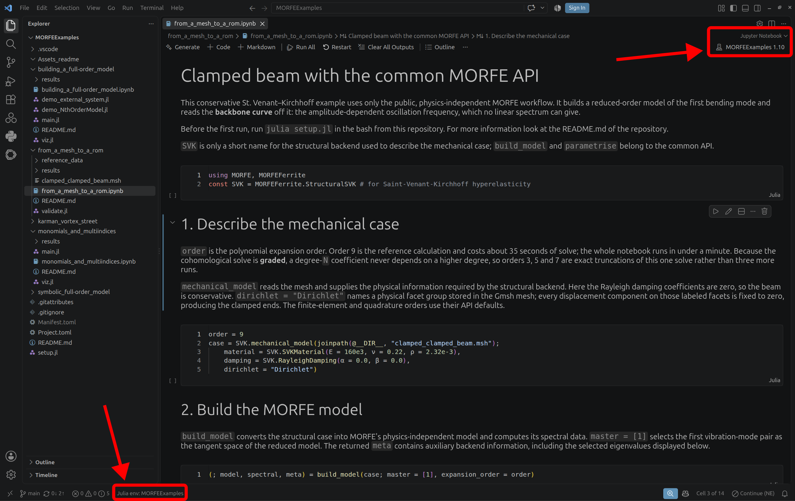

# MORFEExamples
Example repository for MORFE.jl and MORFEFerrite.jl

## Getting Started
Before running the tutorials, set up the Julia environment and install the required packages.

From the root directory of this repository, run:

```bash
julia setup.jl
```

The setup script activates the local Julia environment, installs MORFE, MORFEFerrite, all other necessary packages, and registers a Jupyter kernel called MORFEExamples. The kernel is configured to use the Julia environment of this repository.

After running the setup script, start Jupyter and select the MORFEExamples kernel when opening a tutorial notebook.

The setup only needs to be performed once. The generated Manifest.toml is local to your installation and is therefore not included in this repository.

## Setup for new people to julia
1. Install Julia from https://julialang.org/downloads/manual-downloads/.
2. Install VSCode from https://code.visualstudio.com/download?_exp_download=fb315fc982.
3. Open VSCode and install the **Julia** extension from JuliaLang.
4. Check the extension settings and make sure under Windows that the Julia executable in your `C:` drive is correctly specified under **Julia: Executable Path**.
5. Download the `MORFEExample` folder.
6. Open the `MORFEExample` folder in VSCode.
7. Run `julia setup.jl` in the terminal.#
8. Open the Jupyter notebook example and choose as the kernel `MORFEExamples`

9. Enjoy!

## Overviews of examples

Every example is self-contained, runs under the shared environment above, and is
documented as a tutorial on the [MORFE website](https://morfeproject.github.io/tutorials/).
Notebooks are committed with their outputs cleared, so executing one is the first step.

| Example | What it shows | Tutorial |
| ------- | ------------- | -------- |
| [`monomials_and_multiindices/`](monomials_and_multiindices/) | `MultiindexSet`: the object that decides which monomials the DPIM solve computes, built six ways | [Constructing MultiindexSets](https://morfeproject.github.io/tutorials/multiindex_sets.html) |
| [`building_a_full-order_model/`](building_a_full-order_model/) | `MultilinearMap`, `ExternalSystem` and `NthOrderModel`: the three objects every DPIM computation starts from | [Building a full-order model](https://morfeproject.github.io/tutorials/full_order_model.html) |
| [`symbolic_full-order_model/`](symbolic_full-order_model/) | A full-order model written as symbolic equations rather than assembled by a FEM backend | [Symbolic models](https://morfeproject.github.io/tutorials/symbolics_ext.html) |
| [`from_a_mesh_to_a_rom/`](from_a_mesh_to_a_rom/) | Mesh to ROM for a clamped–clamped beam, and its **backbone curve** read off the reduced dynamics | [Structural SVK](https://morfeproject.github.io/tutorials/structural_svk.html) |
| [`karman_vortex_street/`](karman_vortex_street/) | A 57,860-DOF Navier–Stokes flow reduced to a single Stuart–Landau equation across a Hopf bifurcation | [Kármán vortex street](https://morfeproject.github.io/tutorials/karman.html) |

The first three need only MORFE and run in seconds. The last two use the Ferrite
backend in MORFEFerrite and solve a real finite-element model: the beam takes about a
minute, the cylinder wake a little longer.

Each example has its own README with the exact commands, and the ones that compute a
ROM carry a `validate.jl` that compares a fresh run against a blessed reference.
